# 프로젝트 실행 결과

[← README로 돌아가기](../README.md)

잘못된 입력과 예외 상황에 대한 실행 화면은 **[입력값 검증 및 예외 상황 처리 결과](validation.md)**에서 확인할 수 있습니다.

Python 기반 용돈 기입장 Budget App의 기능별 실행 결과입니다. `image/`의 10개 기능 폴더에 저장된 스크린샷 26장을 바탕으로 실행 명령, 터미널 출력, 저장 파일의 변화를 정리했습니다.

각 화면은 촬영 당시의 데이터를 보여 줍니다. 기능별 화면의 거래 내역과 예산 설정값은 서로 다를 수 있습니다. 아래 거래 ID는 스크린샷의 예시 값이므로 다시 실행할 때는 실제 저장된 ID를 사용합니다.

## 목차

- [1. 거래 추가](#add)
- [2. 거래 목록 조회](#list)
- [3. 조건별 거래 검색](#search)
- [4. 거래 수정](#update)
- [5. 거래 삭제](#delete)
- [6. 월별 요약](#summary)
- [7. 예산 설정 및 조회](#budget)
- [8. 카테고리 관리](#category)
- [9. CSV 가져오기](#import)
- [10. CSV 내보내기](#export)

<a id="add"></a>

## 1. 거래 추가

```bash
python -m budget_app add
```

대화형 입력으로 날짜 `2026-03-01`, 타입 `income`, 카테고리 `food`, 금액 `20000`을 입력했습니다. 메모와 태그는 비워 두었으며, 저장 완료 메시지와 함께 거래 ID `d7aa67`이 출력되었습니다.

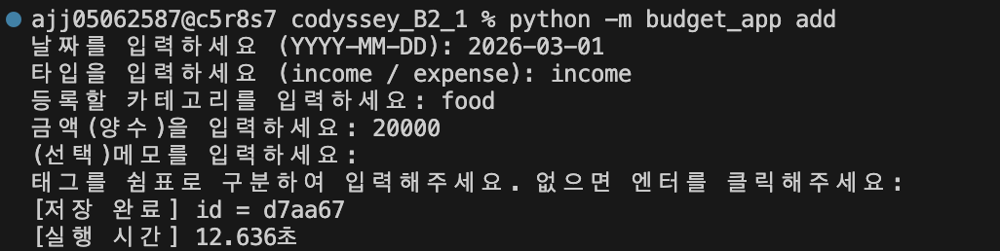

`transactions.jsonl`에 입력한 거래가 한 줄의 JSON 객체로 저장되었습니다. 선택 입력을 생략한 메모와 태그는 각각 빈 문자열과 빈 배열로 저장된 것을 확인했습니다.

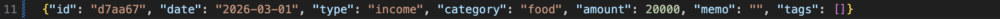

<a id="list"></a>

## 2. 거래 목록 조회

```bash
python -m budget_app list
python -m budget_app list --limit 3
```

기본 목록 조회에서는 거래 10건이 날짜 최신순으로 출력되었습니다. 각 행에는 ID, 날짜, 타입, 카테고리, 금액, 메모, 태그가 표시됩니다.

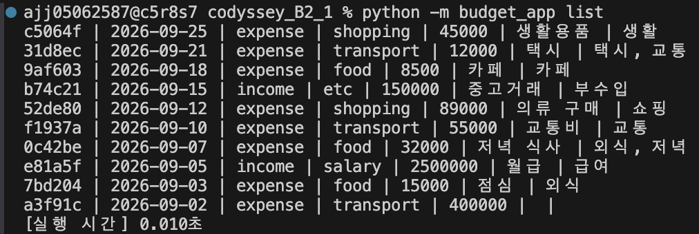

`--limit 3`을 지정하면 최신 거래인 9월 25일, 21일, 18일의 3건만 출력되었습니다.

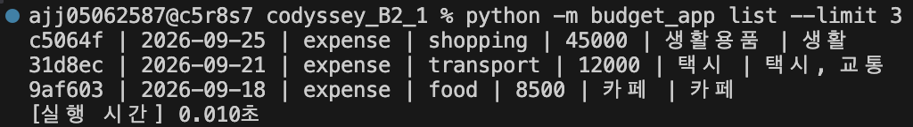

<a id="search"></a>

## 3. 조건별 거래 검색

### 기간 검색

```bash
python -m budget_app search --from 2026-09-02 --to 2026-09-10
```

시작일과 종료일을 포함한 기간 내 거래 5건이 최신순으로 출력되었습니다.

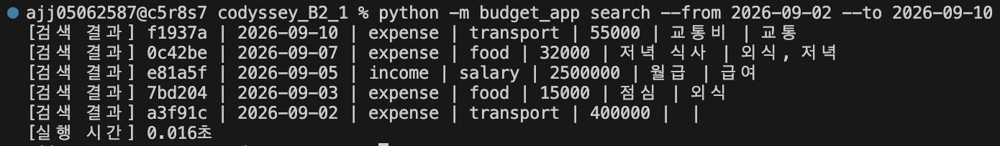

### 카테고리 검색

```bash
python -m budget_app search --category food
```

`food` 카테고리에 해당하는 카페, 저녁 식사, 점심 거래 3건이 출력되었습니다.

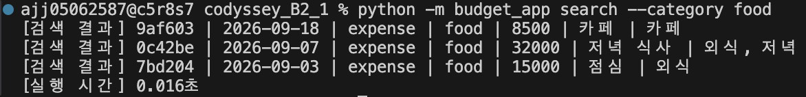

### 타입 검색

```bash
python -m budget_app search --type income
```

수입에 해당하는 중고거래와 월급 2건이 출력되었습니다.

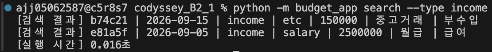

### 메모 검색

```bash
python -m budget_app search --q 점심
```

메모에 `점심`이 포함된 거래 1건이 출력되었습니다.

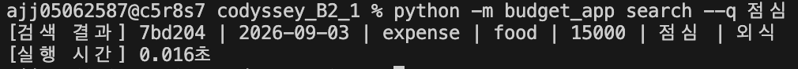

### 태그 검색

```bash
python -m budget_app search --tag 교통
```

`교통` 태그가 포함된 택시와 교통비 거래 2건이 출력되었습니다.

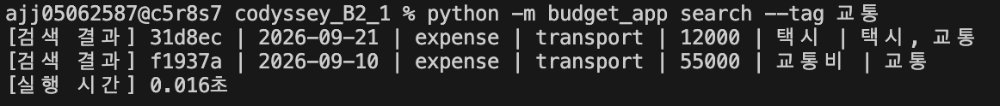

### 복합 조건 검색

```bash
python -m budget_app search --type income --q 월급
```

수입 타입이면서 메모에 `월급`이 포함된 거래 1건이 출력되어, 두 조건을 함께 적용한 결과를 확인했습니다.


<a id="update"></a>

## 4. 거래 수정

```bash
python -m budget_app update --id d7aa67
```

ID로 거래를 선택한 뒤 대화형 메뉴에서 `5.메모`를 선택하고 새 값으로 `test`를 입력했습니다. 터미널에 해당 ID의 수정 완료 메시지가 출력되었습니다.

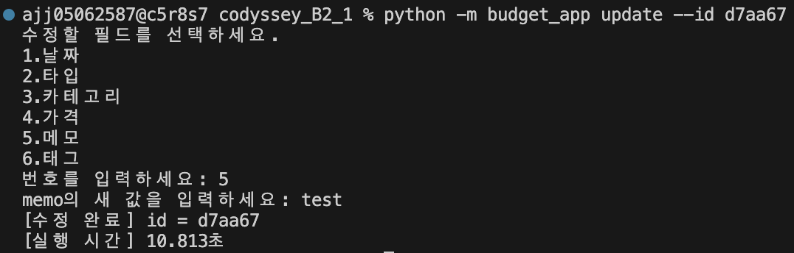

저장 파일에서도 해당 거래의 `memo`가 `test`로 변경되었습니다. 날짜, 타입, 카테고리, 금액 및 태그는 기존 값으로 유지되었습니다.

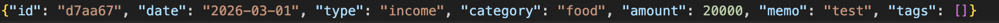

<a id="delete"></a>

## 5. 거래 삭제

```bash
python -m budget_app delete --id d7aa67
```

삭제 확인 질문에 `y`를 입력하자 해당 ID의 삭제 완료 메시지가 출력되었습니다.

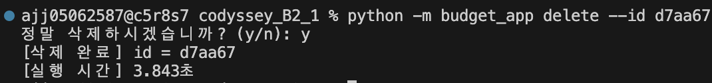

삭제 후 `transactions.jsonl`에서 ID `d7aa67`의 거래가 제거되고 나머지 10건이 남아 있는 것을 확인했습니다.

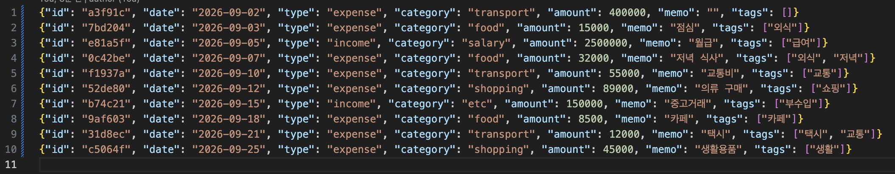

<a id="summary"></a>

## 6. 월별 요약

```bash
python -m budget_app summary --month 2026-09
python -m budget_app summary --month 2026-09 --top 3
```

2026년 9월 거래의 수입, 지출, 잔액이 다음과 같이 집계되었습니다.

| 항목 | 출력 결과 |
| --- | ---: |
| 총수입 | 2,650,000원 |
| 총지출 | 656,500원 |
| 잔액 | 1,993,500원 |

요약 화면 촬영 당시 예산은 **4원**으로 저장되어 있어 사용률 `16412500.0%`와 예산 초과 안내가 함께 출력되었습니다. [예산 설정 및 조회](#budget) 화면의 50,000원과는 다른 설정 상태입니다.

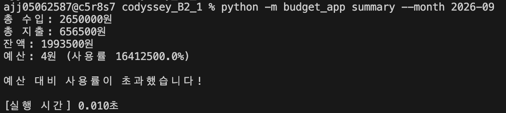

`--top 3` 옵션을 적용하면 카테고리별 지출 합계가 큰 순서대로 추가 출력되었습니다.

| 순위 | 카테고리 | 지출 합계 |
| --- | --- | ---: |
| 1 | transport | 467,000원 |
| 2 | shopping | 134,000원 |
| 3 | food | 55,500원 |


<a id="budget"></a>

## 7. 예산 설정 및 조회

```bash
python -m budget_app budget set --month 2026-09 --amount 50000
python -m budget_app budget show --month 2026-09
```

2026년 9월 예산을 50,000원으로 설정하자 저장 완료 메시지가 출력되었습니다.

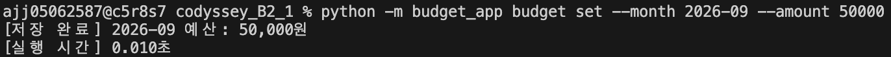

같은 월의 예산을 조회하여 설정한 50,000원이 표시되는 것을 확인했습니다.

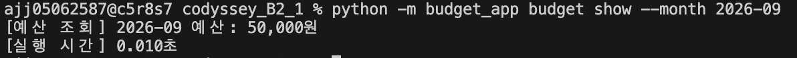

<a id="category"></a>

## 8. 카테고리 관리

```bash
python -m budget_app category list
python -m budget_app category add
python -m budget_app category remove
```

추가 전 목록에는 `food`, `can`, `transport`, `veggies`가 등록되어 있었습니다.

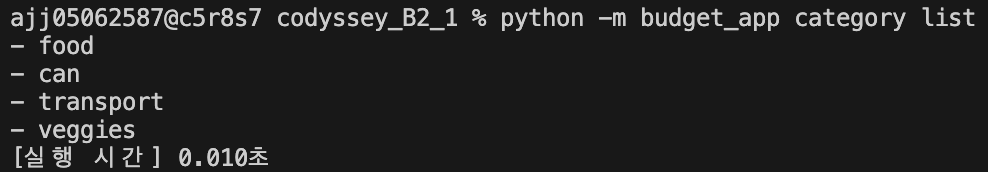

`category add`에서 `shopping`을 입력한 뒤 목록을 다시 조회하여 새 카테고리가 추가된 것을 확인했습니다.

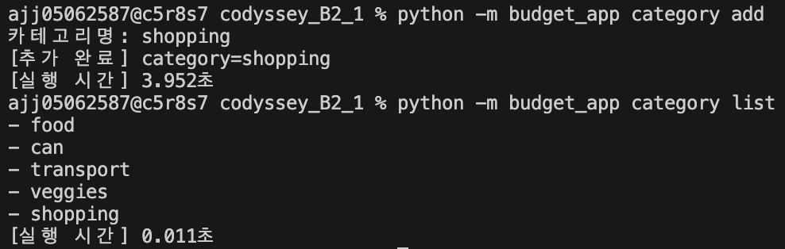

`category remove`에서 `can`을 입력한 뒤 목록을 다시 조회하여 해당 카테고리가 제거된 것을 확인했습니다.

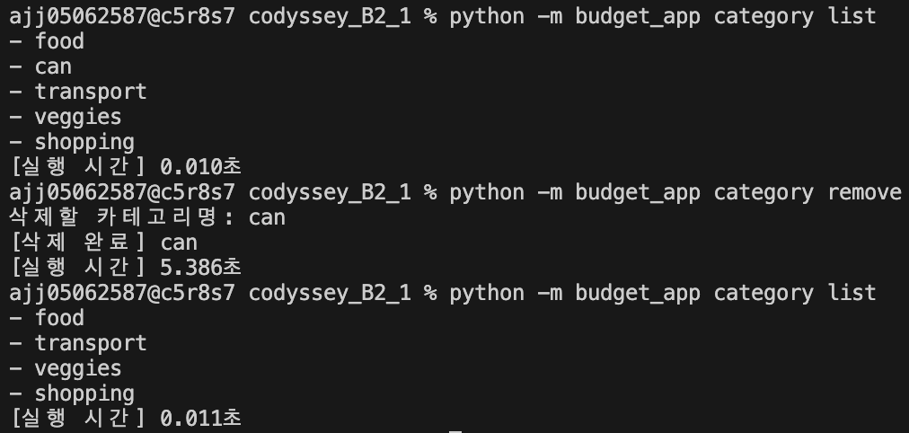

<a id="import"></a>

## 9. CSV 가져오기

```bash
python -m budget_app import --from import.csv
```

가져오기 전 `transactions.jsonl`은 비어 있는 상태였습니다.

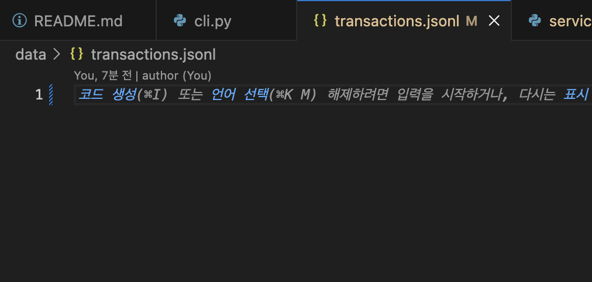

가져오기 명령 실행 후 `저장 5건 / 중복 건너뜀 0건`이라는 완료 메시지가 출력되었습니다.

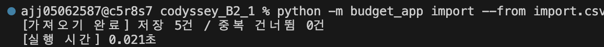

저장 파일에 9월 22일부터 25일까지의 거래 5건이 추가되었습니다. 메모와 태그가 있는 거래뿐 아니라 메모가 빈 문자열이고 태그가 빈 배열인 거래도 저장된 것을 확인했습니다.

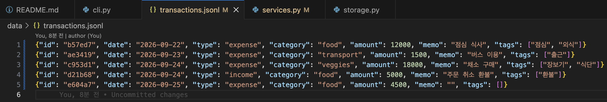

<a id="export"></a>

## 10. CSV 내보내기

```bash
python -m budget_app export --out export.csv --month 2026-09
```

내보내기 전 `export.csv`는 비어 있는 상태였습니다.

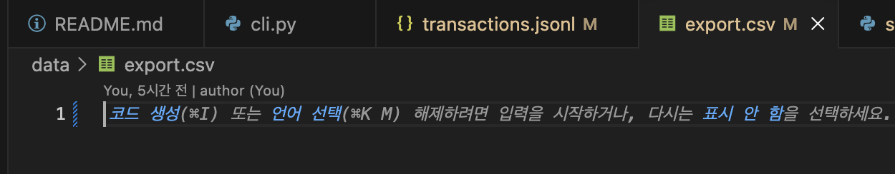

2026년 9월 거래를 내보낸 결과, 터미널에 5건 내보내기 완료 메시지가 출력되고 `data/export.csv`에 거래 내용이 기록되었습니다. 파일에서 `column,required,설명` 헤더와 거래별 필드 행을 확인할 수 있습니다. 빈 메모·태그의 행도 유지되며, 쉼표가 포함된 태그 값은 따옴표로 감싸져 있습니다.

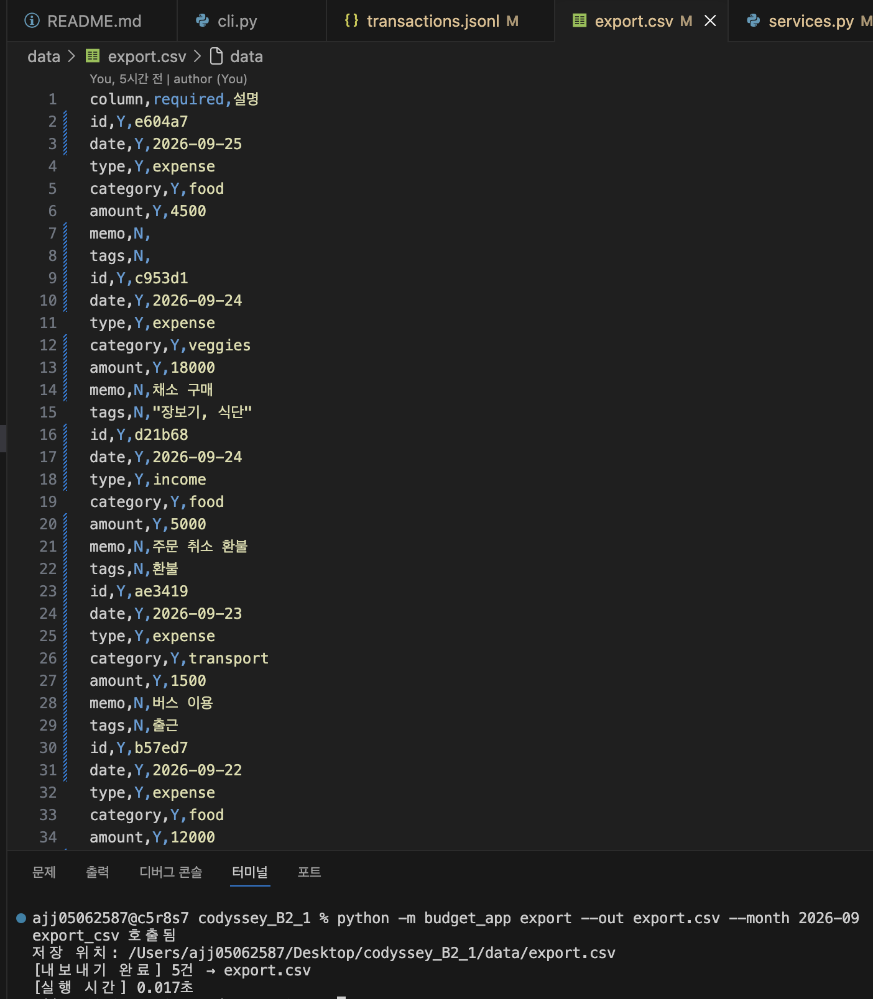

---

[← README로 돌아가기](../README.md)
