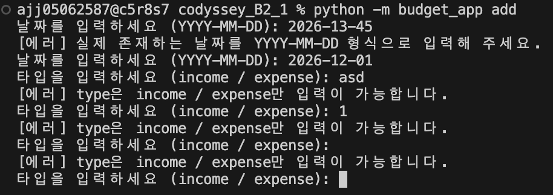
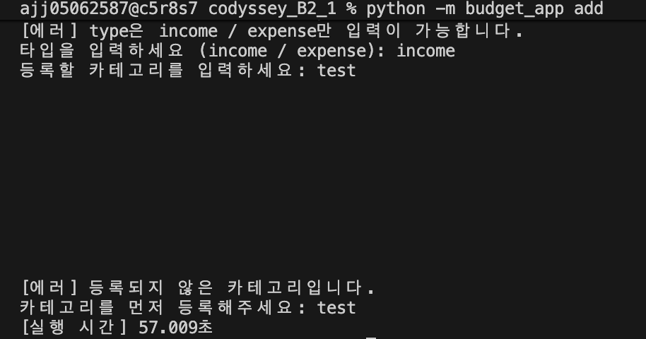
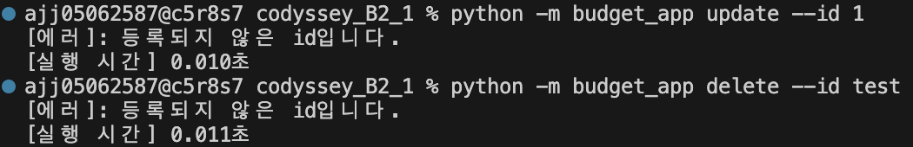
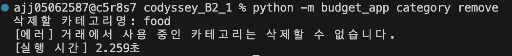
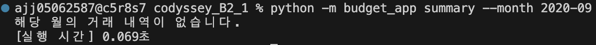
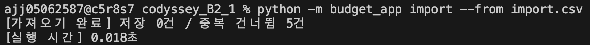

# 입력값 검증 및 예외 상황 처리 결과

[← README로 돌아가기](../README.md) · [기능별 실행 결과](results.md)

`image/validate/`에 저장된 스크린샷 7장을 바탕으로 잘못된 입력과 예외 상황을 처리한 결과를 정리했습니다. 각 항목은 촬영 당시 화면에 표시된 입력값과 응답을 기준으로 작성했습니다.

## 목차

- [1. 존재하지 않는 날짜 입력](#date)
- [2. 잘못된 거래 타입 입력](#type)
- [3. 미등록 카테고리 입력](#unregistered-category)
- [4. 존재하지 않는 ID 수정·삭제](#missing-id)
- [5. 사용 중인 카테고리 삭제](#category-in-use)
- [6. 거래가 없는 달 요약](#empty-month)
- [7. 중복 CSV 가져오기](#duplicate-import)

<a id="date"></a>

## 1. 존재하지 않는 날짜 입력

```bash
python -m budget_app add
```

날짜 입력 단계에서 실제로 존재하지 않는 `2026-13-45`를 입력했습니다. 다음 오류 메시지가 출력된 뒤 날짜 입력을 다시 요청했습니다.

```text
[에러] 실제 존재하는 날짜를 YYYY-MM-DD 형식으로 입력해 주세요.
```

잘못된 날짜가 입력되면 다음 입력 단계로 넘어가지 않고 날짜를 다시 입력하도록 안내하는 것을 확인했습니다.


<a id="type"></a>

## 2. 잘못된 거래 타입 입력

```bash
python -m budget_app add
```

날짜를 `2026-12-01`로 다시 입력한 후 타입에 `asd`, `1`, 빈 값을 차례로 입력했습니다. 세 경우 모두 다음 메시지가 출력되고 타입 입력을 다시 요청했습니다.

```text
[에러] type은 income / expense만 입력이 가능합니다.
```

허용된 거래 타입인 `income` 또는 `expense`를 입력하도록 반복 안내하는 것을 확인했습니다.



<a id="unregistered-category"></a>

## 3. 미등록 카테고리 입력

```bash
python -m budget_app add
```

타입으로 `income`을 입력하고 카테고리에 등록되지 않은 `test`를 입력했습니다. 다음 메시지로 카테고리 선등록을 안내한 뒤 실행이 종료되었습니다.

```text
[에러] 등록되지 않은 카테고리입니다.
카테고리를 먼저 등록해주세요: test
```

미등록 카테고리 입력 시 금액 입력 단계로 진행하지 않고 오류를 안내하는 것을 확인했습니다.



<a id="missing-id"></a>

## 4. 존재하지 않는 ID 수정·삭제

```bash
python -m budget_app update --id 1
python -m budget_app delete --id test
```

촬영 당시 저장된 거래에 없는 ID `1`로 수정을, `test`로 삭제를 시도했습니다. 두 명령 모두 다음 오류를 출력했습니다.

```text
[에러]: 등록되지 않은 id입니다.
```

수정 메뉴나 삭제 확인 단계로 넘어가기 전에 대상 ID가 존재하지 않는다는 사실을 안내하는 것을 확인했습니다.



<a id="category-in-use"></a>

## 5. 사용 중인 카테고리 삭제

```bash
python -m budget_app category remove
```

삭제할 카테고리 이름으로 기존 거래에서 사용 중인 `food`를 입력했습니다. 다음 메시지가 출력되어 삭제가 차단된 것을 확인했습니다.

```text
[에러] 거래에서 사용 중인 카테고리는 삭제할 수 없습니다.
```



<a id="empty-month"></a>

## 6. 거래가 없는 달 요약

```bash
python -m budget_app summary --month 2020-09
```

거래 내역이 없는 `2020-09`를 조회하자 다음 안내가 출력되었습니다.

```text
해당 월의 거래 내역이 없습니다.
```

`2020-09`는 유효한 연월입니다. 이 화면은 날짜 형식 오류가 아니라 조회할 거래가 없는 경우의 처리 결과를 보여 줍니다.



<a id="duplicate-import"></a>

## 7. 중복 CSV 가져오기

```bash
python -m budget_app import --from import.csv
```

이미 저장된 거래가 포함된 CSV 파일을 가져오자 다음 완료 메시지가 출력되었습니다.

```text
[가져오기 완료] 저장 0건 / 중복 건너뜀 5건
```

중복 거래 5건을 건너뛰고 신규 저장 건수를 0건으로 안내한 것을 확인했습니다. 중복 데이터는 오류로 전체 가져오기를 중단하는 대신 건너뛴 건수로 표시되었습니다.



---

[← README로 돌아가기](../README.md) · [기능별 실행 결과](results.md)
